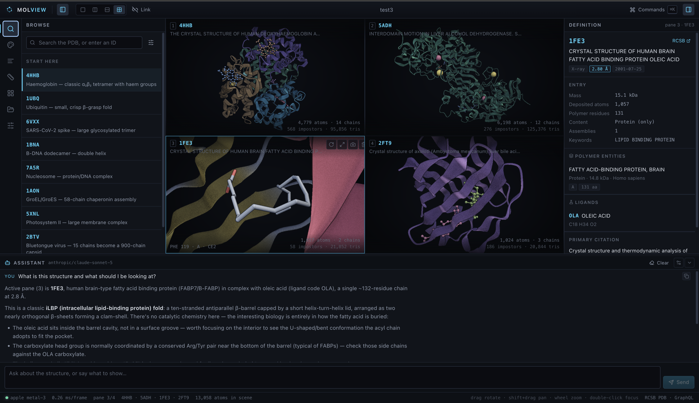

# MolView



<sub>Four panes — 4HHB, 5ADH, 1FE3 and 2FT9 — 13,058 atoms at 0.26 ms/frame,
with the assistant reading the active pane and the oleic acid buried in 1FE3's
β-barrel.</sub>

A WebGPU molecular viewer for the RCSB Protein Data Bank. Browse and search the
PDB, and display up to four structures side by side — including macromolecular
assemblies of millions of atoms.

Everything runs in the browser. There is no server component: the app talks
directly to RCSB's public endpoints and does all decoding, geometry generation
and rendering on the client.

```bash
npm install
npm run dev
```

Requires a WebGPU-capable browser (Chrome/Edge 113+, Safari 18+).

`npm run build` produces a static `dist/`, which is all a deployment is — see
[Deploying](#deploying) below.

## What it does

**Browse and search.** Full-text search across the PDB with filters for
experimental method, resolution, polymer content, source organism and release
date. Results are ranked by relevance, recency or resolution. Typing a
four-character PDB ID anywhere — the search box or the ⌘K palette — loads it
directly.

**Up to four structures at once.** Single, split (horizontal or vertical) or
quad layouts. Each pane has an independent camera, representation, colour
scheme and shading, or you can link the cameras so rotating one rotates all of
them — the usual way to compare two structures.

**Macromolecules.** Coordinates arrive as BinaryCIF, decoded in a worker so the
interface never blocks. The 2.44M-atom HIV-1 capsid (PDB `3J3Q`, a 113 MB
download) loads and renders in about ten seconds.

**Biological assemblies.** What a depositor deposits is the asymmetric unit,
which is frequently not the biological molecule. MolView reads
`pdbx_struct_assembly_gen` and applies the symmetry operators on the GPU, so
every assembly the file declares is one dropdown away and costs a list of
matrices rather than a copy of the atoms:

| Entry | Asymmetric unit | Assembly 1 | Cost |
| --- | --- | --- | --- |
| `1HHO` | 2 chains, 2.4k atoms | tetramer, 4 chains | 2 matrices |
| `1EI7` | 2 chains, 2.8k atoms | 68-chain disk aggregate | 34 matrices |
| `2BTV` | 15 chains, 49k atoms | 900-chain capsid, 2.9M atoms | 60 matrices |

2BTV's complete icosahedral capsid builds in ~1.6 s from a 2.4 MB download and
encodes a frame in 0.17 ms. Assembly 1 is selected automatically unless the
expansion would be extreme (icosahedral entries with thousands of copies stay
opt-in), and the asymmetric unit is always available as an explicit choice.

**Representations are composable.** A pane is an ordered list of *components* —
each one a selection plus how to draw it — applied like layers, so the last
component covering an atom wins. "Cartoon everywhere, spheres on chain A, sticks
at the haem" is three rows, not a special case. Styles are cartoon ribbons with
real secondary-structure cross-sections and β-strand arrowheads, backbone trace,
ball-and-stick, licorice and spacefill. Colour by chain, element, secondary
structure, residue type, B-factor/pLDDT, hydrophobicity, entity, or an N→C
rainbow — per component or inherited from the pane.

Nucleic acid bases are drawn as slabs fitted in their own ring plane, so a
double helix reads as one rather than as two bare tubes. Assembly copies can be
tinted by symmetry operator, which is what makes an icosahedral capsid's facets
and 5-fold vertices visible instead of undifferentiated mush. Shading comes as
named presets — Studio, Soft, Flat, Plain — with the ambient-occlusion, outline
and fog sliders still there underneath.

**NMR ensembles.** Every model at once as backbone traces, which is the usual
way to read the spread, or one at a time with the camera held still as you step
through them. Each model becomes its own chain, so ribbons never run from one
into the next, bond perception cannot join superposed models to each other, and
`model 3` selects a single member.

**Selections** use a compact atom-specification grammar:

| | |
| --- | --- |
| `/A,B` | chains, by auth id |
| `:1-140,200` | residues by sequence number |
| `:HEM` | residues by component name |
| `@CA,N,C,O` | atoms by name |
| `/A:1-140@CA` | all three, intersected |
| `model 3` | one member of an NMR ensemble |

Combined with `and` / `or` / `not`, parentheses, and category keywords —
`protein`, `nucleic`, `polymer`, `ligand`, `ion`, `water`, `hetero`, `helix`,
`sheet`, `coil`, `backbone`, `sidechain`, `hydrogen`, `heavy`. Juxtaposition
means intersection, so `protein /A` is `protein and /A`. A malformed expression
is reported inline and that layer is skipped; the rest of the scene still
renders.

**Measurements and contacts.** Distances, angles and torsions by clicking
atoms, with the value drawn in the viewport. Hydrogen bonds from a geometric
heavy-atom criterion, restricted to what is actually visible and recomputed
when the layers change. The haem Fe to proximal histidine NE2 in `4HHB`
measures 2.14 Å.

**Overlay.** A pane can draw other panes' structures inside it, each keeping its
own superposition, so two folds land on top of each other in one viewport
rather than side by side.

**Superposition.** Align one pane onto another: sequence alignment decides
which residues correspond, then the paired Cα atoms are fitted and the outliers
pruned. Validated against known comparisons — 4HHB's identical alpha chains
0.30 Å, alpha vs beta 1.09 Å, alpha vs sperm whale myoglobin 1.07 Å.

**Shareable links.** The whole session compresses into the URL fragment — a
four-pane project including a 2.9M-atom capsid is about 1 kB of link. A fragment
never reaches a server, so the link discloses nothing in transit. Opening one
works both cold and pasted into a tab already running the app.

**Projects.** A session has a name, shown in the centre of the title bar and
renamed by clicking it; **New project** clears every pane back to defaults.
Save a session in the browser and reopen it later, or export it as
`.molview.json` to move between machines. Saving an already-saved project
updates it in place rather than making a copy. Saving never downloads a file;
export is the only operation that touches the file system. Coordinates are not
stored — entries are referenced by PDB id and refetched, so a two-pane project
is about 2 KB.

**Assistant.** A panel above the status bar talks to any model on
[OpenRouter](https://openrouter.ai). It answers as a structural biologist would
— Markdown with GitHub tables and LaTeX equations — and it can drive the viewer:
loading entries, building representations from selections, measuring, colouring,
switching assemblies, superposing panes. Replies come back as one JSON object
carrying prose plus a list of actions; each action is re-validated against live
state before it runs, so a wrong chain id becomes a stated rejection rather than
a silent no-op. Eighteen action types cover loading, layout, components,
colour, assemblies, focus, lighting, background, hydrogen bonds, measurement,
superposition, overlay and ensembles. Every one is a reversible local view
change, so they run without a confirmation step. **Clear** discards the rolling
history as well as the visible transcript, and aborts a request in flight.

Where the model supports structured outputs — Claude and GPT do — the reply
shape is enforced by the API and the prompt does not restate the schema, which
is both cheaper and stricter. A toggle in Settings falls back to describing the
schema in the prompt, which is also what happens automatically for models that
cannot be constrained.

The API key is typed into Settings, held in that tab's `sessionStorage`, and sent
only to openrouter.ai — MolView has no server to send it to. It is never written
into a project or a shareable link.

Each reply is followed by its cost — `model · 1,340 in · 382 out`, with
reasoning tokens called out when the model bills for thinking it does not show.
A turn starts at about 1,300 input tokens; what grows it is the rolling history
of three exchanges, not the size of the structure, since the scene is counts and
chain names rather than coordinates. **Clear** is what resets it.

**Validation.** The wwPDB validates the whole archive, and the definition panel
shows what it found: steric clashes, Ramachandran and rotamer outliers, fit to
density where structure factors were deposited, backbone coverage for cryo-EM.
Numbers rather than a grade — a green tick would invite the uncritical reading
this exists to prevent — with a dot for the judgement and a sentence only when
something is genuinely poor. A metric that could not be measured says why:
`4HHB` has no density fit because structure factors were not deposited in 1984.
It is worth knowing that the same entry, the classic haemoglobin, has a
clashscore of 142 where a modern structure at 1.74 Å sits near 2. The assistant
sees the summary too, so it will mention a weak model unprompted.

**Inspection.** Hover or click any atom for its residue, chain and atom name.
The sequence track is built from the loaded coordinates, so gaps in the model
appear as gaps and every residue you click actually exists in the scene. Chains
can be hidden or focused individually. A front clipping plane slices into the
interior of large assemblies.

**Local files.** Drop an mmCIF or BinaryCIF file onto a pane, or open one from
the Panes tool. Nothing is uploaded.

## RCSB endpoints

| Purpose | Endpoint |
| --- | --- |
| Molecular definitions and metadata | `data.rcsb.org/graphql` |
| Search | `search.rcsb.org/rcsbsearch/v2/query` |
| Coordinates (BinaryCIF) | `models.rcsb.org/{id}.bcif` |
| Coordinates (mmCIF fallback) | `files.rcsb.org/download/{ID}.cif` |

Search returns identifiers only; a single batched GraphQL query then fetches the
definition for a whole page of hits.

## Architecture

```
src/
  rcsb/        GraphQL + Search clients, MessagePack, BinaryCIF, mmCIF text parser
  mol/         Structure model, element data, bond perception, colour schemes,
               selections, components, measurements, alignment, loading worker
  gfx/         WebGPU engine, camera, geometry generation, WGSL shaders, text
  ai/          Action vocabulary and executor, prompt, OpenRouter client,
               reply parser, Markdown/KaTeX renderer
  viewer/      Controller bridging React state to GPU resources
  ui/          Application shell, panels, command palette, assistant
  state/       Zustand store, project serialisation, IndexedDB, share links
```

**The structure model** is structure-of-arrays: flat typed arrays for
coordinates, elements, residues and chains, with atom and residue names interned
into a shared string table. Loading happens in a worker and the whole model is
transferred back zero-copy.

**Rendering** is deferred. Atoms are ray-traced sphere impostors — four vertices
each, exact silhouettes and exact depth from the fragment shader — which is what
makes millions of atoms tractable. Bonds are instanced cylinder meshes. Cartoons
are a generated triangle mesh, swept along a Catmull-Rom spline through the Cα
trace using Carson–Bugg peptide-plane frames, with cross-sections that vary by
secondary structure.

Instance data lives in **storage buffers rather than vertex buffers**, which is
what makes assemblies nearly free: a draw issues `instanceCount x transformCount`
instances and the shader recovers `atom = i % n`, `copy = i / n`. A scene is a
list of groups — one per assembly generator, since generators replicate
different chain subsets — each holding its geometry once plus the matrices it
repeats under.

All four panes render into one G-buffer via viewport and scissor rectangles,
then a single resolve pass applies screen-space ambient occlusion, three-point
lighting, depth-discontinuity outlines and fog. Because shading happens once,
after rasterisation, an impostor sphere and a ribbon are lit identically and
read as parts of the same object.

Occlusion radius, outline thresholds and fog density are normalised against
scene size, so the same settings look the same on a 20 Å ligand and a 1000 Å
capsid.

**Labels** are a separate pass after the resolve, blended straight onto the
swap chain so they never touch the G-buffer. The font atlas is rasterised at
runtime with Canvas 2D — no font ships, and the metrics match whatever
monospace face the platform actually has. An opaque block reserved in the atlas
lets the background pills go through the same pipeline as the glyphs.

**Assistant replies** are rendered with `marked` + KaTeX + DOMPurify. Two
orderings matter: math is lifted out before Markdown parsing, because emphasis
rules will otherwise chew through `\frac{a}{b}`; and KaTeX runs *after*
sanitisation, writing into the already-cleaned DOM, since sanitising KaTeX's own
output would strip the markup it depends on. Model HTML is dropped and non-http
links are defanged. The whole renderer is dynamically imported, keeping KaTeX's
330 kB out of the initial bundle.

## Interaction

| | |
| --- | --- |
| Rotate | drag |
| Pan | shift-drag, or middle/right drag |
| Roll | alt-drag |
| Zoom | wheel |
| Focus a residue | double-click |
| Select | click |
| Command palette | ⌘K |
| Search | ⌘F |
| Panes 1–4 | `1` `2` `3` `4` |
| Reset view | `R` |
| Auto-rotate | `S` |
| Link cameras | `L` |
| Toggle panels | `[` `]` |

## Known limits

- Secondary structure comes from the file's `struct_conf` / `struct_sheet_range`
  records. When a file carries none, a Cα-geometry heuristic stands in; it is
  not DSSP and will differ at the edges of helices and strands.
- Only the dominant alternate conformation is read; altloc B and beyond are
  discarded.
- Whole-structure bond perception is skipped above 250,000 atoms, so
  ball-and-stick on very large structures falls back to ligand connectivity.
  Cartoon and spacefill are unaffected.
- Picking is a linear scan over atom centres, repeated for each assembly copy
  whose bounding sphere the ray crosses; the hover interval widens with scene
  size to keep the cost off the frame budget.
- Secondary structure, hydrogen bonds and superposition are geometric
  approximations, not DSSP, an energetic H-bond analysis, or a structure-based
  aligner. They are good enough to look at and to reason from; they are not
  what you would cite.
- A pane opened from a local file has no id to refetch, so a project must embed
  its bytes to restore it. That is an opt-in, capped at 25 MB per file, and
  never included in a shareable link.
- The deferred pipeline is opaque-only — there is no transparency, and no
  molecular surface representation.

## Deploying

The repo carries a [fly.io](https://fly.io) configuration. There is no server
component, so a deployment is a Vite build served by nginx: no secrets, no
environment variables, no volumes, no database.

Install [flyctl](https://fly.io/docs/flyctl/install/) and sign in:

```bash
fly auth login
```

Claim the app name — this reserves it and starts nothing, so it costs nothing:

```bash
fly apps create molview
```

If the name is taken it fails immediately; pick another and change `app` in
[fly.toml](fly.toml) to match. Then, from the repo root:

```bash
fly deploy
```

That builds the Dockerfile on Fly's remote builder — Docker does not need to be
running locally — and starts one machine. Every later deploy is the same
command. The app is then at `https://<app>.fly.dev`.

**HTTPS is mandatory, not a preference:** WebGPU requires a secure context, so
the app does not start over plain http. `force_https` in `fly.toml` covers it.

The machine sleeps when idle (`auto_stop_machines = 'suspend'` with
`min_machines_running = 0`), so an unvisited deployment costs nothing and the
first request after an idle period pays about a second of wake-up. Set
`min_machines_running = 1` if that matters.

To check the image locally before deploying:

```bash
docker build -t molview:test . && docker run --rm -p 8099:80 molview:test
```

The files involved are `Dockerfile`, `nginx.conf`, `security-headers.conf`,
`fly.toml` and `.dockerignore`. [DEPLOY.md](DEPLOY.md) explains what each one
assumes — caching, the Content Security Policy and the hosts it allows, and why
the token cost of the assistant is the only cost that scales.

## Contributions

**Pull requests are closed automatically.** MolView is a personal project, so
this is not a judgement on any particular change — nothing gets merged, and a PR
left open would only waste the time of whoever wrote it. Fork it and take it
where you like.

Issues are a different matter: a bug report, or a structure that renders wrong,
is genuinely useful and gets read.

## Licence

[MIT](LICENSE). The dependencies are all permissive too — MIT, ISC, and
DOMPurify under your choice of MPL-2.0 or Apache-2.0 — so a fork carries no
copyleft obligation. Structures come from the RCSB PDB, whose data is in the
public domain; MolView neither redistributes nor caches it.
